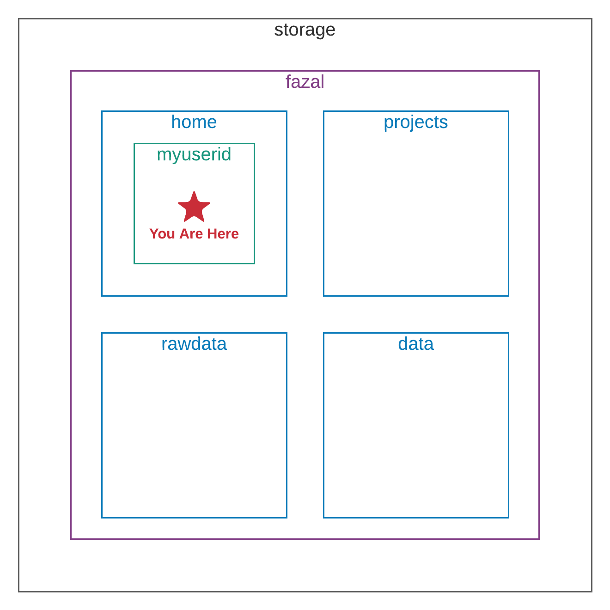
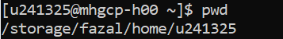

# Introduction to Using the Command Line

Welcome! This page will give you a quick introduction to using the TACO cluster. When you 
sign in to the TACO cluster, everything is controlled by the command line, which is where 
you type commands for the computer to execute. Here are a few simple commands you will want 
to know!


## Sign In to the TACO Cluster
Type this command, replacing `myuserid` with your user ID:
```
ssh myuserid@taco.grid.bcm.edu
```
Then press "Enter".

When prompted, type your password and press "Enter".

Now you're in!


## Navigate

You may be wondering, "Now I'm in? In where? Where am I on the TACO cluster?" That's a great 
question! Here's a map:



You are in a folder named `myuserid`, which is inside a folder named `home`. The folder `home` 
is inside a folder named `fazal`, which is inside the "root" folder named `storage`. To quickly 
describe where you are, this is your address:
```
/storage/fazal/home/myuserid
```
This address is also called an absolute path, because it shows the path to your location all the 
way from the "root" folder. To show your absolute path on the screen, type the command `pwd` and press 
"Enter". `pwd` stands for "Print Working Directory", which is the same as "show current folder".



If you want to change your location, use the command `cd`, which stands for "Change Directory". After 
you type `cd`, hit the spacebar and type the address of your destination so that the computer knows 
where to take you.
```
cd /absolute/path/to/destination
```
Then press "Enter" and you will arrive at your destination!

Once you arrive at your destination, you can use the command `ls` to "List" the contents of your 
current folder.

Now you know how to use `pwd` to print the address to your current folder, `cd` to change folders, 
and `ls` to list the contents of your current folder. That's everything you need to know about 
navigating from the command line!


## Create, Copy, and Rename

To make a new folder inside your current folder, use the `mkdir` command. It stands for "Make 
Directory". Type `mkdir` and the name of your new folder, but make sure that the name only has 
letters, numbers, and underscores in it. (Spaces and other special characters will confuse the 
computer.)
```
mkdir NewFolderName
```

```
cp /absolute/path/to/filetocopy.txt /absolute/path/to/destination
```

```
mv oldfilename.txt newfilename.txt
```

