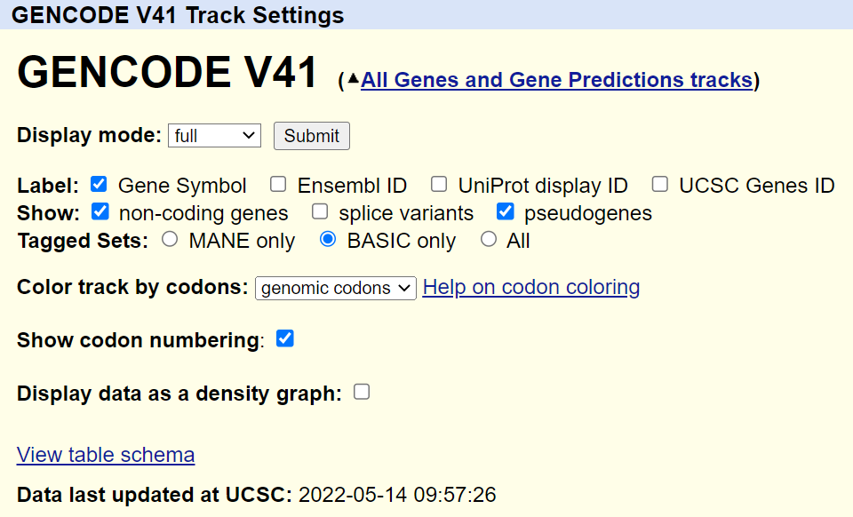

# Viewing Genome Tracks in the UCSC Genome Browser

After running the [BamToBigWig](https://fazallabbcm.github.io/FazalLabPipelines/BamToBigWig) pipeline, follow 
these steps to view your genome tracks in the [UCSC Genome Browser](https://genome.ucsc.edu/).

## Host Your BigWig Files Online

  1. Go to your processed data folder on the cluster and download every BigWig file that ends in 
     "controls_uns.norm_avg.bw" or "targets_uns.norm_avg.bw" to your local computer.
     
     > **Note:** If you chose to combine controls for data analysis with ProcessCounts, only download one 
     > control file: "all_controls_uns.norm_avg.bw"
     
     > **Note:** "uns" stands for unstranded. If you would like to see separate genome tracks 
     > for the forward and reverse strands, download the files ending in "controls_fwd.norm_avg.bw", 
     > "controls_rev.norm_avg.bw", "targets_fwd.norm_avg.bw", and "targets_rev.norm_avg.bw" instead.
     
  2. Sign in to [BackBlaze](https://www.backblaze.com/) (this is the online data hosting service we use in the lab). 
  
     > **Note:** The sign in information is in the Lab Passwords document on OneDrive.
     
  3. Click `Browse Files`, then select the bucket `BigWigFiles`.
  
  4. Add a new folder for your experiment.
  
  5. Open the new folder and upload your BigWig files.

## Add Tracks to the Genome Browser

  6. Open Notepad (Windows) or TextEdit (Mac).
  
  7. For each BigWig file that you uploaded to BackBlaze: copy and paste this track line on a new line in the blank 
     note, then replace `Name` and `URL`.
     
     ```
     track type=bigWig name="Name" bigDataUrl=URL color=68,68,68 visibility=hide
     ```
     
     > **Note:** The `Name` of your track is the name of your BigWig file (but you can remove ".norm_avg.bw" and use 
     > spaces instead of underscores if you want).
     
     > **Note:** To get the `URL` for your BigWig file, click on the file name in BackBlaze to see its details, 
     > then copy the "Friendly URL".
     
  8. [Login to the UCSC Genome Browser](https://genome.ucsc.edu/cgi-bin/hgLogin?hgLogin.do.displayLoginPage=1) 
     (or sign up if you don't have an account).
     
  9. Open the [custom track management page](https://genome.ucsc.edu/cgi-bin/hgCustom) to add your custom tracks.
  
  10. Paste your custom track lines into the "Paste URLs or data" text box, then press `Submit`.

## Create a Track Collection

  11. At the top of the screen, select `My Data` and then `Track Collection Builder`.
  
  12. On the right side of the screen next to "Collected Tracks" click `Add Collection`. Give your collection a 
      name, then click `Save`.
      
  13. On the left side of the screen under "Available Tracks", click the folder labeled "Custom Tracks". Then click 
      the green plus sign next to each track you just uploaded to add it to your new collection. (You should see the 
      tracks being added under the new collection folder you just made.)
      
  14. On the right side of the screen, double click each of target tracks and change the color.
      
      > **Note:** Here are some good colors to choose from. Just enter the code into the "Color" box and press `Save`.
      > 
      > 
      > 
      > 
      > 
  
  15. Click `GO` in the top right corner of the screen to return to the browser.

## Configure the Viewing Window

  16. Scroll down to the collections listed below the viewing window. Make sure that all of the tracks and collections 
      are set to "hide" except for your new collection and the others shown below:
      
      
  
  17. Click `configure` at the bottom of the viewing window to configure the image according to your preferences. 
      Then click `submit`.
      
      > **Note:** These are the default settings that I would recommend:
      > 
      > 
  
  18. Drag the bar to the left of the GENCODE collection to position the genes above your tracks (as shown below).
      
      
      
      Now click the same bar to configure the genes displayed, then click `Submit`.
      
      > **Note:** These are the default settings that I would recommend:
      > 
      > 
      
  19. Click the gray bar to the left of your collection to configure your tracks, then click `Submit`.
      
      > **Note:** These are the default settings that I would recommend:
      > 
      > 
      
  20. If you know of a good gene to have featured when you open your session, type the gene name in the search box 
      and select it from the drop-down list of results.
      
      
  
## Save Your Session
  
  20. At the top of the screen, select `My Data` and then `My Sessions`.
  
  21. Under the heading "Save Settings", locate the option to "Save current settings as named session". Replace the 
      text `hg38` with the name of your session and click `submit` on the right.
      
  Now anyone can access your session at anytime using the link stored under "My Sessions".
      
  Happy browsing!
