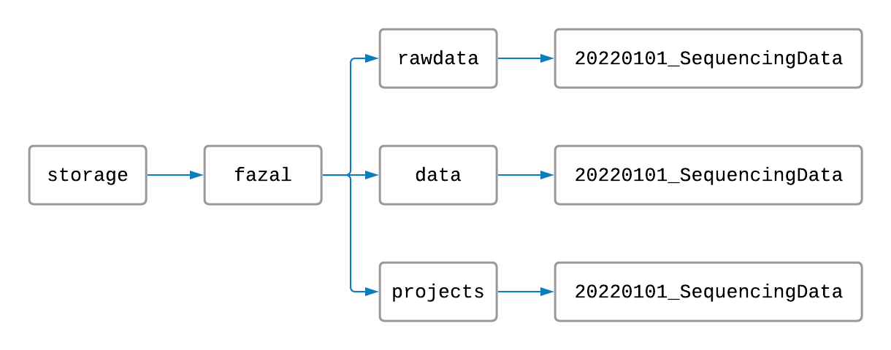

# TrimMapCount
The [TrimMapCount](https://fazallabbcm.github.io/FazalLabPipelines/TrimMapCount) pipeline will map 
your RNA sequences to a reference genome and count how many reads map to each gene. This process 
produces useful data files from your raw data.


## Setup


> #### First things first:
> To use the pipelines, you will need to know how to use a few simple commands on the 
> [TACO cluster](http://taco-wiki.grid.bcm.edu/mediawiki/index.php/MHGCP_User_Quick_Start_Guide). 
> If you don't know how to sign in to the cluster, navigate in and out of folders, or make new folders, 
> visit this link: [Introduction to Using the Command Line](https://fazallabbcm.github.io/FazalLabPipelines/BasicLinuxCommands)


#### Making project folders

On the TACO cluster, the Fazal lab has folders named `rawdata`, `data`, and `projects`. The 
`rawdata` folder is for your raw data files, the `data` folder is for your processed data files, 
and the `projects` folder is for all of your tables, figures, and log files (log files keep track 
of the progress of your running projects).

To begin, you should create a `rawdata` folder, `data` folder, and `project` folder all with the 
same name. The name should have today's date and a title for your project separated by an underscore 
(for example: `YYYYMMDD_MyProject`). Your file structure and file names should look something like this:



Naming and arranging our folders this way will help keep the TACO cluster organized.

If your data is from an experiment with multiple cell locations, create folders inside the `rawdata` 
and `data` folders for each cell location like this:


#### Naming raw data files

Next, make sure that each of your `fastq` files are named following these rules (in order and separated 
by underscores):
   1. Each file name starts with the capitalized and abbreviated cell location (such as "NLS" for nucleus).
   2. Each file name has an experimental condition (such as a time limit, a cell type, or "none").
   3. Each file name has the word "target" or "control".
   4. Each file name has a number to indentify which target or control sample it represents.
   5. Each file name ends in "R1.fastq" or "R2.fastq" (or "R1.fastq.gz" and "R2.fastq.gz" for zipped files).

For example, data from the nucleus with two target samples and one control sample might be named like this:
   ```
   NLS_basal_target_1_R1.fastq
   NLS_basal_target_1_R2.fastq
   NLS_basal_target_2_R1.fastq
   NLS_basal_target_2_R2.fastq
   NLS_basal_control_1_R1.fastq
   NLS_basal_control_1_R2.fastq
   ```

Now, move these files into the appropriate `rawdata` location folders. Your files should now be organized like 
this:


#### One last thing

Finally, make sure there is a folder named `star` inside `/storage/fazal/genome/human/2021` and that it 
is not empty. This folder is important for your data to align to the genome. It likely already 
exists and has files in it, but visit [this page](https://fazallabbcm.github.io/FazalLabPipelines/GenerateGenome) 
if not.

Now you are ready to process your raw data!


## Execution

1. From the command line, navigate to your `project` folder.

2. Copy and paste the code
   ```
   sbatch /storage/fazal/projects/2022_TrimMapCount/TrimMapCount.sh rawdata data
   ``` 
   in the command line. Replace `rawdata` with the absolute path to the `rawdata` folder containing your `fastq` files. 
   Replace `data` with the absolute path to the `data` folder where your processed data files will be generated. Then 
   press the "Enter" key.

