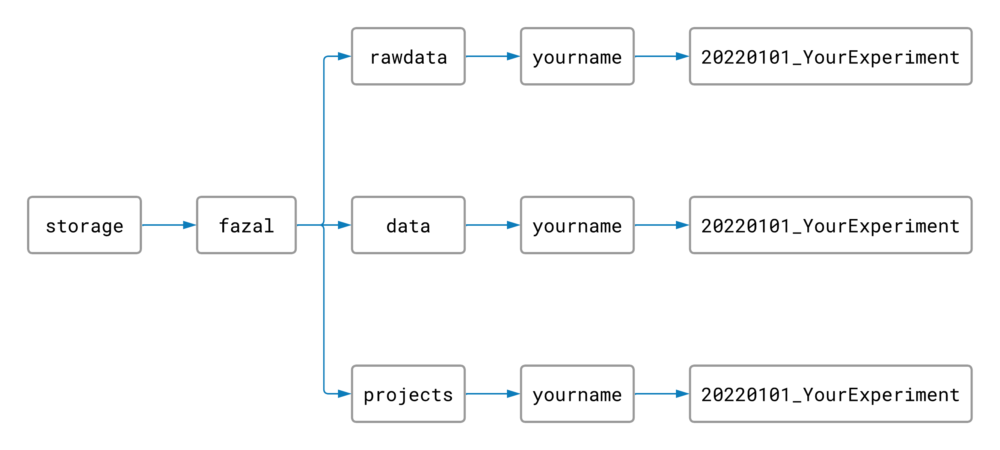
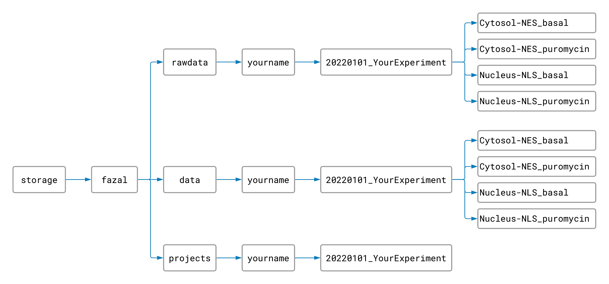
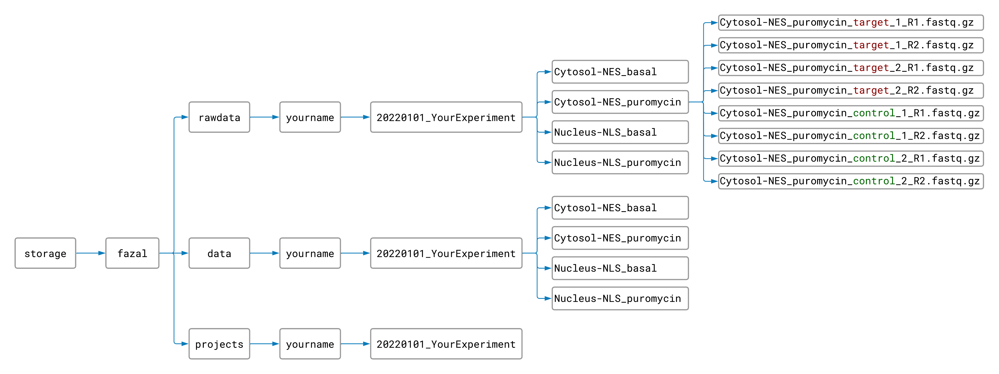

# TrimMapCount: Data Alignment for RNA-Seq Experiments

The TrimMapCount pipeline will map your RNA sequences to a reference genome and count how many reads 
map to each gene. This process produces useful data files from your raw data.


## Setup


### Making Project Folders

On the TACO cluster, the Fazal lab has folders named `rawdata`, `data`, and `projects`. The 
`rawdata` folder is for your raw data files, the `data` folder is for your processed data files, 
and the `projects` folder is for all of your output tables and figures.

To begin, you should create a folder inside your `rawdata` folder, `data` folder, and `project` folder 
all with the same name. The name should have today's date and a title for your project separated by an 
underscore (for example: `YYYYMMDD_MyProject`). Your file structure and file names should look something 
like this:



Naming and arranging our folders this way will help keep the TACO cluster organized.


### Naming Raw Data Files

In order for the pipeline to understand your experiment and what data is in each file, you have to name 
your raw data files a certain way that the computer will recognize.

Rename your raw FASTQ files so that each file name has these 5 things (in order and separated 
by underscores):

   1. **Targeted location/protein** (can't contain an underscore)
      * For an APEX-seq experiment, the subcellular location where APEX is targeted and/or which protein the 
        enzyme is fused to
   2. **Experimental condition** (can't contain an underscore)
      * Could be a time limit, cell type, antibiotic treatment, etc., or "basal" for no condition
        > Note:
        > Need to label your data files with more experimental conditions? Just separate the extra conditions 
        > with a hyphen or period like this: `CellLine-TargetedProtein_DrugTreatment.TimeLimit_target_1.R1.fastq`. 
   3. **"target" or "control"** (first letter can be capitalized)
      * For an APEX-seq experiment, whether the targeted location was labeled by adding H<sub>2</sub>O<sub>2</sub> 
        (target) or not (control)
   4. **A number to indicate which target or control sample** (one digit 0-9)
   5. **"R1.fastq" or "R2.fastq"** (or "R1.fastq.gz" and "R2.fastq.gz" for zipped files)


For example, if cytosolic RNA was the target (APEX enzyme fused to NES protein), and your cells were all treated with puromycin for 30 minutes...

|  ...your data files might be named like this:  |  ...or maybe like this:  |
|  :-  |  :-  |
|  `CytosolNES_puromycin30min_target_1_R1.fastq.gz` `CytosolNES_puromycin30min_target_1_R2.fastq.gz` `CytosolNES_puromycin30min_target_2_R1.fastq.gz` `CytosolNES_puromycin30min_target_2_R2.fastq.gz` `CytosolNES_puromycin30min_control_1_R1.fastq.gz` `CytosolNES_puromycin30min_control_1_R2.fastq.gz` `CytosolNES_puromycin30min_control_2_R1.fastq.gz` `CytosolNES_puromycin30min_control_2_R2.fastq.gz`  |  `NES_puro_target_1_R1.fastq.gz` `NES_puro_target_1_R2.fastq.gz` `NES_puro_target_2_R1.fastq.gz` `NES_puro_target_2_R2.fastq.gz` `NES_puro_control_1_R1.fastq.gz` `NES_puro_control_1_R2.fastq.gz` `NES_puro_control_2_R1.fastq.gz` `NES_puro_control_2_R2.fastq.gz`  |

However you choose to name your files, just make sure you follow the 5 rules and that your file names are all consistent (same style, same spelling, same capitalization, etc.).


### Sorting Raw Data Files

Create folders inside your experiment's `rawdata` and `data` folders for each combination of targeted 
location and experimental condition in your experiment like this:



(This step isn't neccessary, but it can save a lot of time. Instead of processing only one sample at a 
time, separating your data into subfolders makes it possible to process samples for every location and 
condition at the same time. Since each sample takes about 2 hours to process, you won't want to skip 
this step!)

Move your renamed raw data files into the appropriate `rawdata` folders. Your files should now be 
organized like this:



Now you are ready to run the pipeline! (The other pipelines don't require any setup, so the worst part is over 😊.)


## Running the Pipeline

1. Copy and paste this code in the command line and press "Enter". (It will tell the computer where to find 
   the code for the pipeline.) 
   ```
   export PATH=/storage/fazal/pipelines/TrimMapCount/scripts:"${PATH}"
   ```
   
2. Repeat steps 3 and 4 for each subfolder in your experiment's raw data folder.
   
3. Run the following code (replacing the file paths with the paths to your experiment's 
   raw data and processed data subfolders):
   ```
   TrimMapCount -r /storage/fazal/rawdata/yourname/yourexperiment/location_condition \
                -d /storage/fazal/data/yourname/yourexperiment/location_condition
   ```

4. Make sure that the raw data and processed data file paths are correct. Then enter "y" to 
   start the pipeline.


## What next?

You can check the log file in your processed data folder to see the progress of your job as it runs.

Once [TrimMapCount](https://fazallabbcm.github.io/FazalLabPipelines/TrimMapCount) has finished, 
you will have all of the data files necessary for the 
[ProcessCounts](https://fazallabbcm.github.io/FazalLabPipelines/ProcessCounts) and 
[BamToBigWig](https://fazallabbcm.github.io/FazalLabPipelines/BamToBigWig) pipelines. Head back 
to the [main page](https://fazallabbcm.github.io/FazalLabPipelines/QuickStart) to keep going!
