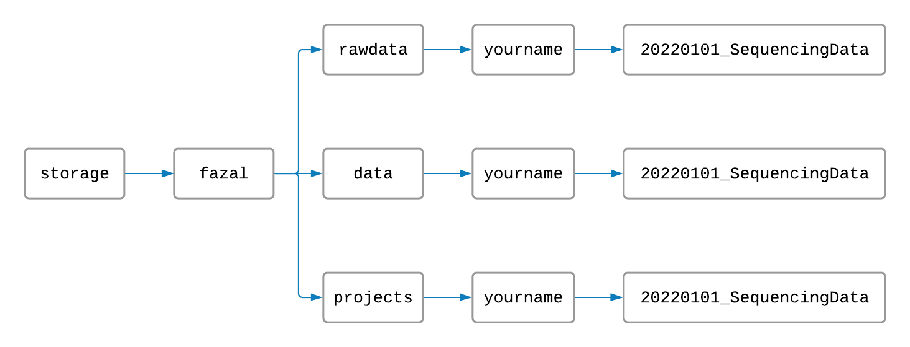
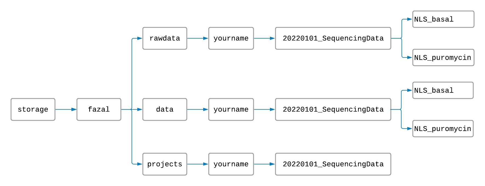
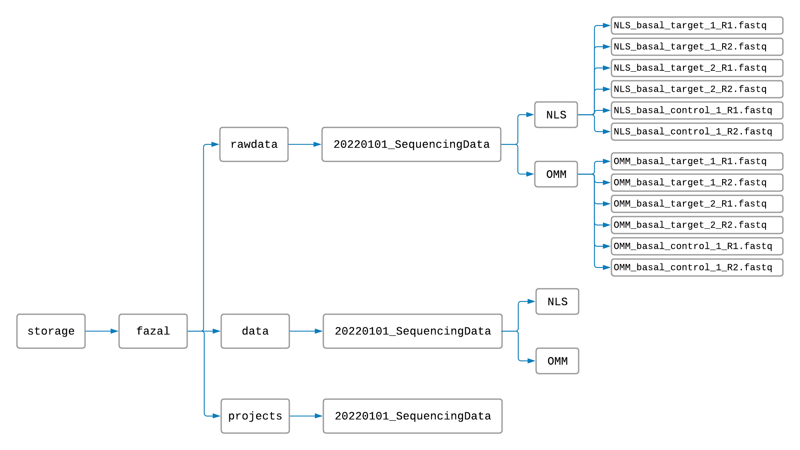

# TrimMapCount
The [TrimMapCount](https://fazallabbcm.github.io/FazalLabPipelines/TrimMapCount) pipeline will map 
your RNA sequences to a reference genome and count how many reads map to each gene. This process 
produces useful data files from your raw data.


## Setup


> #### First things first:
> To use the pipelines, you will need to know how to use a few simple commands on the 
> [TACO cluster](http://taco-wiki.grid.bcm.edu/mediawiki/index.php/MHGCP_User_Quick_Start_Guide). 
> If you don't know how to sign in to the cluster, navigate in and out of folders, or make new folders, 
> visit this link: [Introduction to Using the Command Line](https://fazallabbcm.github.io/FazalLabPipelines/BasicUnixCommands)


#### Making Project Folders

On the TACO cluster, the Fazal lab has folders named `rawdata`, `data`, and `projects`. The 
`rawdata` folder is for your raw data files, the `data` folder is for your processed data files, 
and the `projects` folder is for all of your tables, figures, and log files (log files keep track 
of the progress of your running projects).

To begin, you should create a folder inside your `rawdata` folder, `data` folder, and `project` folder 
all with the same name. The name should have today's date and a title for your project separated by an 
underscore (for example: `YYYYMMDD_MyProject`). Your file structure and file names should look something 
like this:



Naming and arranging our folders this way will help keep the TACO cluster organized.

Now, create folders inside the `rawdata` and `data` folders for each combination of cell location and 
experimental condition in your experiment like this:



(This step isn't neccessary, but it can save a lot of time. Instead of processing only one sample at a 
time, separating your data into subfolders makes it possible to process samples for every location and 
condition at the same time. Since each sample takes about 2 hours to process, you won't want to skip 
this step!)


#### Naming Raw Data Files

> If you already have the `fastq` data files you would like to process, proceed with the instructions. If you 
> still need to download the raw data, [click here](https://fazallabbcm.github.io/FazalLabPipelines/DownloadRawData)
> before continuing.

Make sure that each of your `fastq` files are named following these rules (in order and separated 
by underscores):
   1. Each file name starts with the capitalized and abbreviated cell location (such as "NLS" for nucleus).
   2. Each file name has an experimental condition (such as a time limit, a cell type, an antibiotic treatment, 
      or "none").
   3. Each file name has the word "target" or "control".
   4. Each file name has a number to indentify which target or control sample it represents.
   5. Each file name ends in "R1.fastq" or "R2.fastq" (or "R1.fastq.gz" and "R2.fastq.gz" for zipped files).

For example, data from the nucleus with two target samples and one control sample, all treated with puromycin, 
might be named like this:
   ```
   NLS_puromycin_target_1_R1.fastq
   NLS_puromycin_target_1_R2.fastq
   NLS_puromycin_target_2_R1.fastq
   NLS_puromycin_target_2_R2.fastq
   NLS_puromycin_control_1_R1.fastq
   NLS_puromycin_control_1_R2.fastq
   ```

Now, copy these files into the appropriate `rawdata` folders. Your files should now be organized like this:




#### One Last Thing

Finally, make sure there is a folder named `star` inside `/storage/fazal/genome/human/2021` and that it 
is not empty. This folder is important for your data to align to the genome. It likely already 
exists and has files in it, but visit [this page](https://fazallabbcm.github.io/FazalLabPipelines/GenerateGenome) 
if not.

Now you are ready to process your raw data!


## Execution

1. From the command line, navigate to your `project` folder.
   - (In the example, the absolute path would be `/storage/fazal/projects/yourname/20220101_SequencingData`.)

2. Repeat steps 3 through 6 for each location and condition subfolder in your `rawdata` folder.

3. Copy and paste the code
   ```
   sbatch /storage/fazal/projects/1_TrimMapCount/TrimMapCount.sh rawdata data
   ``` 
   in the command line.
   
4. Replace `rawdata` with the absolute path to the `rawdata` subfolder containing your `fastq` files.
   - (In the example, the absolute path would be `/storage/fazal/rawdata/yourname/20220101_SequencingData/NLS_puromycin`.)
   
5. Replace `data` with the absolute path to the `data` subfolder where your processed data files will be generated. 
   - (In the example, the absolute path would be `/storage/fazal/data/yourname/20220101_SequencingData/NLS_puromycin`.)
   
6. Press "Enter" to start the pipeline.

