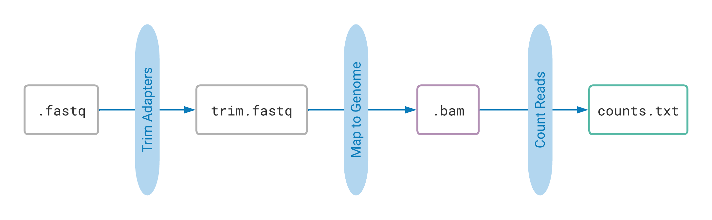
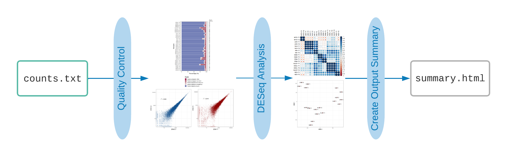
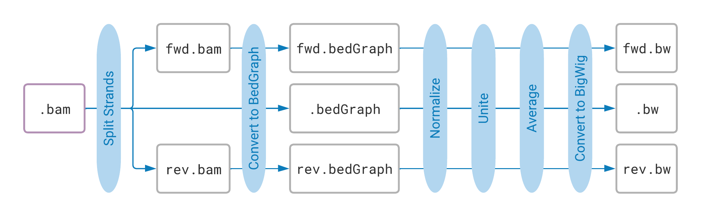

# Quick Start Guide: Processing Your RNA-Seq Data

Welcome! You have just collected (or are about to download) RNA sequencing data from an experiment, 
and you need to process it! This page will show you how to do this using the the Fazal Lab 
pipelines.

> #### First things first:
> To use the pipelines, you will need to know how to use a few simple commands on the 
> [TACO cluster](http://taco-wiki.grid.bcm.edu/mediawiki/index.php/MHGCP_User_Quick_Start_Guide). 
> If you don't know how to sign in to the cluster, navigate in and out of folders, make new folders, 
> and rename files, start with this short tutorial: 
> [Introduction to Using the Command Line](https://fazallabbcm.github.io/FazalLabPipelines/BasicUnixCommands)

If you don't yet have data files to process, click here to 
[download raw data](https://fazallabbcm.github.io/FazalLabPipelines/DownloadRawData).

## Begin Here
The raw sequencing data you collected is in FASTQ format (the file names end in ".fastq"). It 
may also be compressed or zipped to save space (if so, the file names will end in ".fastq.gz"). 
Your data isn't very useful or even readable this way, but it contains the results of your 
experiment! Your goal is to process this raw data with the provided pipelines in order to generate 
useful output files and figures. Follow the steps and links below to begin!

1. To start, use the [TrimMapCount](https://fazallabbcm.github.io/FazalLabPipelines/TrimMapCount) 
   pipeline. This is always step 1. It will map your RNA sequences to a reference genome and count 
   how many reads map to each gene. This process produces useful data files from your raw data.
   
   

2. Next, run the [ProcessCounts](https://fazallabbcm.github.io/FazalLabPipelines/ProcessCounts) 
   pipeline. This will use the output from TrimMapCount to create simple tables and figures. These 
   tables and figures help show the quality of your raw data and the results of your experiment.
   
   

3. Finally, use the [BamToBigWig](https://fazallabbcm.github.io/FazalLabPipelines/BamToBigWig). 
   pipeline. This pipeline uses the output from TrimMapCount to create genome tracks for your data. 
   The genome tracks will be stored in BigWig files that can be uploaded and viewed in interactive 
   tools such as the [UCSC Genome Browser](https://genome.ucsc.edu/).
   
   
