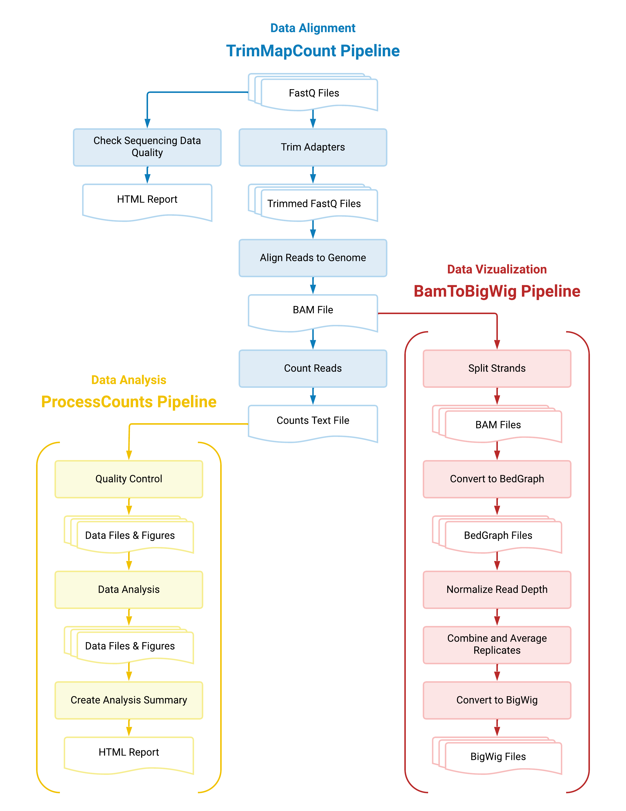
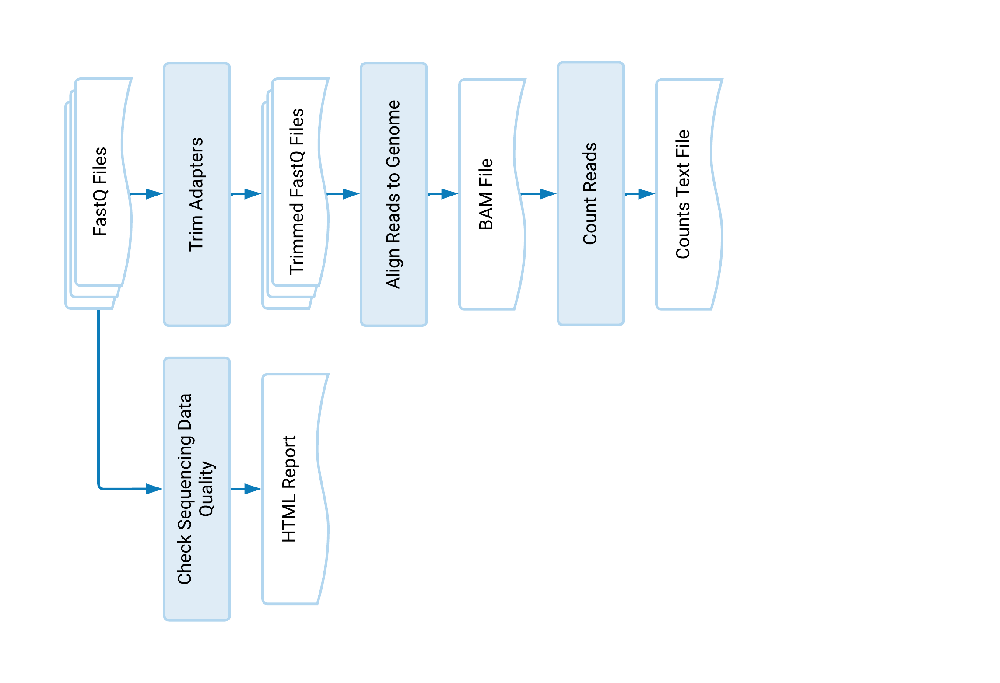
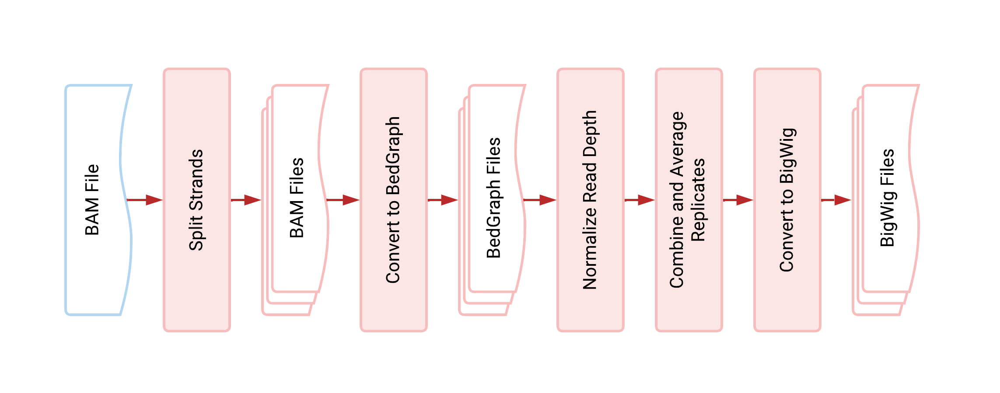

# RNA-Seq Analysis Made Simple

The steps and software packages used in these pipelines are not unique to those of other 
RNA-Seq workflows, but here we have put them together into user-friendly pipelines. We hope 
you will benefit from their simplicity just as we do in the Fazal Lab!

## Data Alignment
Start by aligning your RNA-Seq data to the genome with the 
[TrimMapCount](https://fazallabbcm.github.io/FazalLabPipelines/TrimMapCount_new) pipeline. This 
pipeline will trim, map, and count your FASTQ reads with [icSHAPE](https://github.com/qczhang/icSHAPE), 
[STAR](https://github.com/alexdobin/STAR), and [HTSeq](https://github.com/htseq/htseq).

## Data Analysis
Next, analyze your data with the [ProcessCounts](https://fazallabbcm.github.io/FazalLabPipelines/ProcessCounts_new) 
pipeline. This pipeline will process your FASTQ read counts with [DESeq2](https://github.com/mikelove/DESeq2) 
to obtain enrichment values and an analysis summary full of quality-control figures.

## Data Visualization
Finally, visualize your data with the [BamToBigWig](https://fazallabbcm.github.io/FazalLabPipelines/BamToBigWig_new) 
pipeline. This pipeline will convert your BAM files to normalized, united, and averaged BigWig files, which can 
be viewed using interactive tools such as the [UCSC Genome Browser](https://genome.ucsc.edu/).

